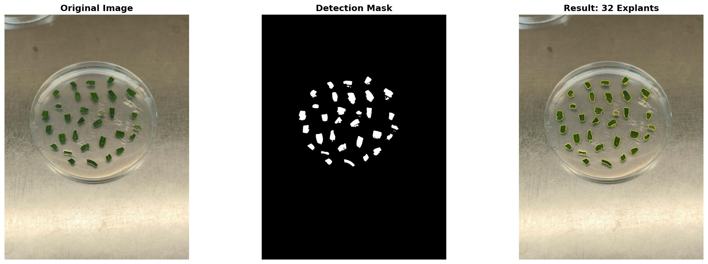

# Cotyledon Explant Counter

Automated counting of tomato cotyledon explants on MS plates using computer vision (OpenCV).

## Features
- Automatic detection and counting of green cotyledon explants
- Color-based segmentation using HSV color space
- Adjustable parameters for different lighting conditions
- Visual output showing detected explants with numbers

## Requirements
- Python 3.6+
- OpenCV
- NumPy
- Matplotlib

## Installation
```bash
pip install -r requirements.txt
```

## Usage

1. Place your plate images in the `image_folder/` directory
2. Open `cotyledon_counter.ipynb` in Jupyter Notebook
3. Adjust parameters if needed:
   - `lower_green`, `upper_green`: HSV color range for green detection
   - `min_area`, `max_area`: Size range for explant filtering
4. Run all cells

## Parameters

| Parameter | Default | Description |
|-----------|---------|-------------|
| `lower_green` | [35, 60, 50] | Lower HSV threshold for green detection |
| `upper_green` | [85, 255, 255] | Upper HSV threshold for green detection |
| `min_area` | 1000 | Minimum explant area in pixels |
| `max_area` | 60000 | Maximum explant area in pixels |

## Example Output



## How It Works

1. **Color Space Conversion**: Converts images from BGR to HSV for better color detection
2. **Color Masking**: Creates a binary mask where green pixels are white
3. **Morphological Operations**: Cleans up the mask by removing noise and filling holes
4. **Contour Detection**: Finds boundaries of green regions
5. **Size Filtering**: Keeps only contours within the explant size range
6. **Counting**: Number of valid contours = number of explants

## License
MIT License

## Author
Nikolaos Ntelkis
